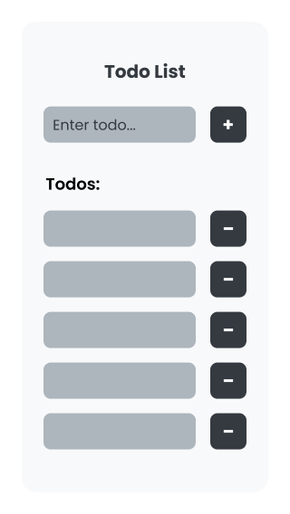

## PLAN

#### Deliverables:

- Create a todo list of any kind using js.
- Be sure to use arrays and objects within the creation of the list.
- Submit via Github repo link

Timeframe:

- 24hrs

#### Approach:

- Create files
  - index.html file (structure) ✅
    - use boilerplate ✅
  - index.js file (interactivity) ✅
    - link to html file (test working with alert) ✅
  - style.css file (basic styling) ✅
    - test working with background color ✅
    - add page reset styles for full control ✅
    - mediaqueries.css file for responsiveness later if required ✅

#### Requirements, Elements & Components:

- User must be able to type a todo

  - Input field ✅
    - select element by id ✅
    - add event listener onchange ❌: not required
    - e.target.value ✅: event is depreciated?(look into this)
    - if using a form setup prevent default as there is no action or method ❌: not required

- User must be able to submit a todo

  - Button(plus icon / +)
    - onclick ✅
    - push to array ✅
      - each todo should be an object with a key of id and message ✅
      - loop over array and display contents ✅
      - any new content added should spread array and add to end ✅
      - if adding delete functionality add delete button to each todo added ✅

- When todo is submitted it must go somewhere ✅
  - ## add section for ul, li and give id ✅

#### Features:

- user wants to delete a todo ✅
  - button (delete icon / -) ✅

#### Stretch goals:

- work on validation (empty todo submission, character length of todo)
- user wants to edit todo
- add time and date of todo submission
- checkBox or strikeThrough for completed todos
- design and styling (make UI error proof)
- responsive layout

#### Wireframes:

